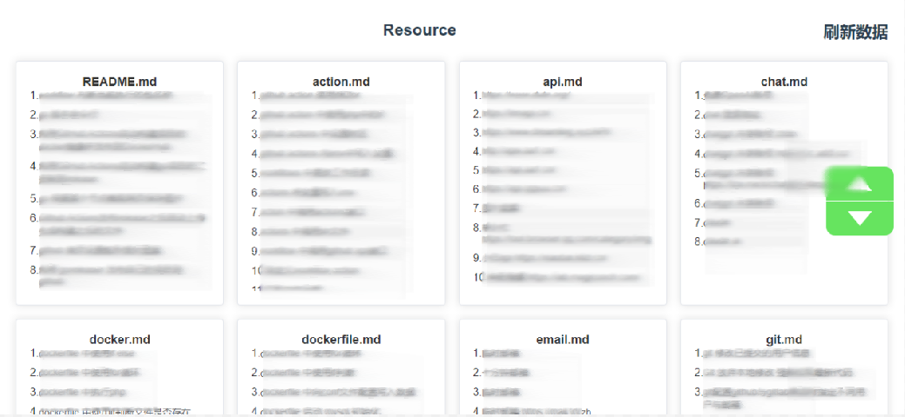

# 简述
    将 github 私有库中的笔记，渲染到 web 网站上。

> **Note**
>
> 私有库中的笔记文件名格式必须为：`xxx.md`
>
> 私有库中的笔记内容格式必须为：
>
>       [描述1](https://www.baidu.com)<br>
>       [描述2](https://www.baidu.com)<br>

# 使用方式

克隆项目

```bash
git clone https://github.com/xiaoxuan6/resource-web.git
```

复制 `.env.example` 为 `.env`, 修改里面的参数为自己的配置。 然后运行

```go
go run main.go
```

## Docker部署

### docker 直接运行

```docker
docker run -it --name resource -e GITHUB_TOKEN="xxx" -e GITHUB_OWNER="xxx" -e GITHUB_REPO="xxx" -p 8080:8080 -d ghcr.io/xiaoxuan6/resource:latest
```

### Docker-compose

环境要求：Git、Docker、Docker-Compose

复制 `docker-compose.yml`, 修改里面的 `environment` 参数为自己的配置。

```bash
docker-compose up -d
```

部署成功后，通过 `ip + 端口号` 访问，默认端口为：`8080`

# FAQ

为什么不使用 `websocket`, 而使用 `axios` 请求?

答：项目中调用了 `api.github` 频繁访问可能会导致请求失败，会被 `github` 拉黑

# 相关
[cli 模式](https://github.com/xiaoxuan6/rsearch)

[向储存库中提交代码：search ap "\[描述\](链接)"](https://github.com/xiaoxuan6/search)